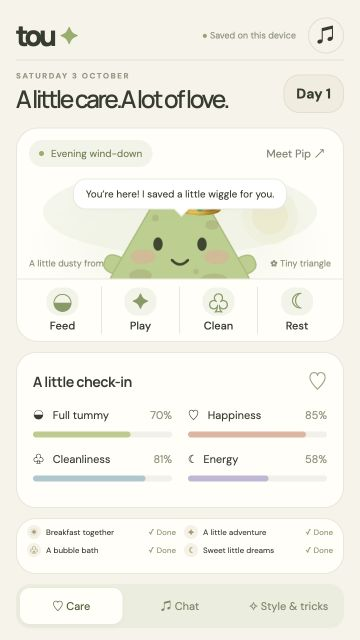

# Tou: a little triangle, a big friendship

Tou is a small pet-care game for your phone. Feed your triangle, wash it, let it rest, and play together. You can also choose its name, outfits, and colors.

I wanted a simple character to feel like a companion through the little things: a happy dance, a familiar routine, and remembering your favorite color.

**Status:** working prototype · Android debug APK v1.0.6 · native iOS project prepared, not signed or released.

[Product case study](docs/CASE-STUDY.md) · [Product brief](docs/PRODUCT-BRIEF.md) · [Android setup](ANDROID.md) · [iPhone setup](IOS.md) · [Verification notes](docs/TESTING.md)

## Product and technical documentation

[PRD and product logic](docs/PRD.md) | [Feature list](docs/FEATURES.md) | [Tech stack](docs/TECH-STACK.md) | [Architecture diagrams](docs/ARCHITECTURE.md)

## The experience

- **Pet and Talk:** two main destinations, with care actions beside the pet.
- **Care:** hunger, happiness, cleanliness, energy, daily tasks, and a care streak. Needs change with elapsed time, including time away.
- **Play:** Hop, Twirl, and Dance open directly from the pet's Play button. Tricks contribute to daily play.
- **Personalize:** four outfits, six colors, and an editable name.
- **Expressive character:** animated hands, facial expressions, visible dirt, care effects, magical twirl audio, and a voiced dance clip.
- **Conversation:** typed messages, browser-dependent voice input, spoken replies, and local memory for your name, favorite color, and food.
- **Local progress:** browser storage and Capacitor Preferences in native builds. No account required.

Conversation uses local rules, not a general-purpose AI model. Growth stages change the displayed life-stage label; a richer visual lifecycle is future work.

## Design in progress



This screenshot shows an earlier version. The current interface has two main tabs, **Pet** and **Talk**, with tricks and dress-up opened in place. See the [case study](docs/CASE-STUDY.md) for the decisions behind those changes.

## Try it locally

The browser game requires no build step:

```sh
python3 -m http.server 8080 --bind 127.0.0.1
```

Open `http://localhost:8080`. Microphone permissions and speech support vary by browser. A public playable demo is still to come.

## Native builds

Node.js 22+, pnpm, and the relevant native development tools are required.

```sh
pnpm install --frozen-lockfile
pnpm build
pnpm android:sync
# Or:
pnpm ios:sync
```

Android requires Java 21 and an Android SDK. iOS requires Xcode and Apple signing. Full instructions are in [ANDROID.md](ANDROID.md) and [IOS.md](IOS.md).

Download the [Android test installer](https://github.com/guptasippy3-cloud/tou/releases/tag/v1.0.6). See [phone installation instructions](docs/NATIVE-INSTALL.md).

The Android test installer is generated at `android/app/build/outputs/apk/debug/app-debug.apk`. It should be distributed through a GitHub Release rather than committed to the repository. No signed iOS installer or TestFlight release is available.

## Verification

```sh
node tests/experience.cjs 1
node tests/experience.cjs 2
node tests/experience.cjs 3
```

The latest focused tests passed 37 checks across three runs, covering navigation, care, memories, audio file contents, playback requests, mute, colors, outfits, and syntax. Tests use simulated browser APIs. I still need to test sound quality and behavior on real phones. [Read the verification limits](docs/TESTING.md).

## Built with

HTML, CSS, JavaScript, SVG animation, browser audio and speech APIs, Capacitor, Capacitor Preferences, esbuild, and locally bundled DM Sans and Manrope fonts.

```text
index.html / style.css / app.js   Browser game
public/                         Icons, fonts, and audio
scripts/                        Bundling and audio generators
android/ and ios/               Native projects
 tests/                         Automated checks and earlier review artifacts
 docs/                          Product case study and verification notes
```

## My role

I came up with the idea, shaped the experience, and reviewed each version. I used AI coding assistance to help build and refine the app. The [case study](docs/CASE-STUDY.md) explains the changes I made and what I learned along the way.

## Next steps

- Verify audio, keyboard behavior, saved progress, and lifecycle on physical devices.
- Capture a current demo video and screenshots.
- Publish an HTTPS web demo and an Android test release.
- Build and sign iOS for device testing.
- Develop richer life-stage visuals and a more capable conversation experience.

## Assets and licensing

See [asset notes](docs/ASSETS.md). A repository license has not yet been selected; no open-source license is implied.
