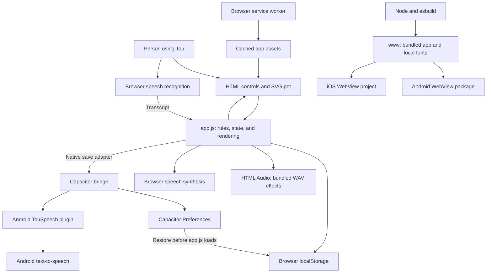
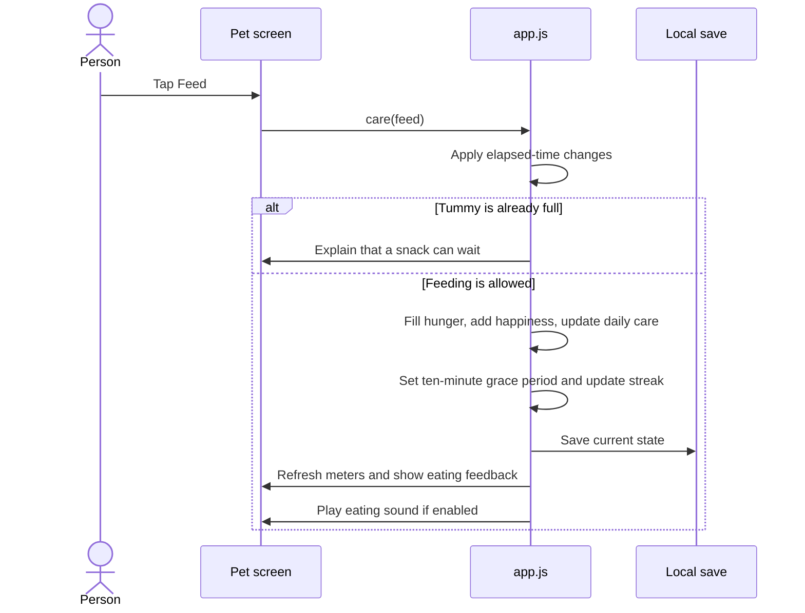

# How Tou works

Tou runs on the user's device. The interface, game rules, pet state, and generated sounds are bundled together. There is no cloud account, server-side game engine, or remote AI model.

## System architecture

The native branch applies only inside the Capacitor app. Browser builds use localStorage directly. iOS uses browser speech synthesis; Android uses the native speech plugin. Voice recognition is optional and browser-dependent.

The boxes describe responsibilities. Most browser responsibilities live together in app.js, rather than in separate services or modules.

## A care action

Play opens the trick panel first. Choosing a trick runs performTrick, which has its own energy cost and updates the play checklist and streak.

## Saved data

One JSON object is stored under `tou-pet-v1`.

| Data | Examples |
|---|---|
| Identity | Name, creation time, setup completed |
| Care | Hunger, happiness, cleanliness, energy, sleeping flag |
| Timing | Last update, care grace expiry, action dates |
| Personalization | Outfit and pet color |
| Relationship | Remembered name, color, and food; current/best streak |
| Audio preferences | Sound enabled, voice choice, pitch, rate, and volume |

The selected screen and recent chat messages are not persisted. Recent chat is limited to eight exchanges per visit.

Native startup reads Preferences and mirrors the saved JSON into localStorage before loading app.js. Later native saves are queued in order. Browser saving is synchronous; the native write completes asynchronously.

## Recovery and boundaries

Invalid or incomplete saved data falls back to a new pet. Restored stats are clamped to 0–100 and preference values are restricted to known options. Save failures display a message; there is no cloud backup.

Clock changes cannot produce negative elapsed hours, but this is not a tamper-resistant simulation. The current background handler stops speech and the older recording element; generated activity audio needs further lifecycle testing.

The public snapshot leaves out the older voice recordings. Activity sounds and dynamic speech remain available. Automated checks simulate APIs; physical-device behavior is still pending.
