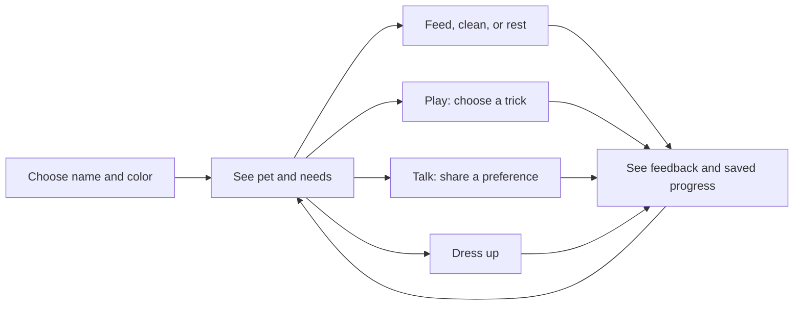

# Tou product requirements document

**Owner:** Sippy Gupta  
**Version:** 1.0, 4 October 2026  
**Status:** documents the current prototype and the next validation step

## The problem I’m exploring

I want to understand whether a small virtual pet can make a short phone session feel personal and enjoyable. The app should give someone a clear thing to do and a character that responds to their care.

This is a product hypothesis. Demand, repeat use, and the target audience have not been validated through a formal study.

## Who it is for

People who enjoy casual pet games and short playful interactions. I still need to learn which audience finds the experience useful enough to return to it.

## Goals

- Let someone create a pet and complete a care action without learning a complex interface.
- Make the pet's needs and responses easy to understand.
- Preserve progress between visits on the same device.
- Make play, personalization, and conversation easy to discover.

The first version does not include cloud accounts, purchases, multiplayer, notifications, or open-ended AI conversation.

## The main journey



## Requirements and acceptance criteria

| ID | Priority | Requirement | Acceptance criteria | Status |
|---|---|---|---|---|
| R1 | Essential | First setup | Name and color can be chosen, saved, and edited later | Implemented |
| R2 | Essential | Daily care | Feed, Clean, Rest/Wake and visible needs are reachable from Pet | Implemented |
| R3 | Essential | Clear responses | Successful actions update meters and show feedback; blocked actions explain why | Implemented |
| R4 | Essential | Saved progress | Browser reload restores valid saved state; native startup reads Preferences first | Implemented; native restart testing pending |
| R5 | Important | Play | Play opens three tricks; tired pets explain that rest is needed | Implemented |
| R6 | Important | Simple navigation | Pet and Talk are the only main destinations; secondary panels have Done | Implemented |
| R7 | Important | Daily continuity | Checklist uses the local date; care streak increments once daily | Implemented |
| R8 | Important | Remember preferences | Supported name/color/food statements save; questions recall them; forgetting clears them | Implemented |
| R9 | Secondary | Personalization | Four outfits and six colors save without changing care values | Implemented |
| R10 | Important | Sound control | Activity clips exist, play on interaction, and respect mute and volume | Implemented; perceived quality pending |
| R11 | Important | Voice alternatives | Typing remains available if recognition or speech is unavailable | Implemented; device support varies |
| R12 | Essential | Phone usability | Core tasks fit the phone screen and remain usable with the keyboard | Intended behavior; device verification pending |

Implemented means the behavior exists in code. It does not mean every acceptance criterion has been verified on a physical device.

## Care logic

A successful care action follows this order:

1. Apply elapsed time since the last update, allowing for any existing grace period.
2. Check the action's guard, such as an already-full tummy.
3. Update meters, keeping every value between 0 and 100.
4. Record the daily task and care streak where applicable.
5. Save, refresh the interface, and play visual/audio feedback.

Feed adds 100 hunger and 4 happiness, which fills hunger after clamping. Clean adds 100 cleanliness and 5 happiness. Rest adds 100 energy and marks the pet asleep. Tapping Rest while asleep wakes it without a new care reward or grace period.

A visible trick requires at least 10 energy. It uses 2 energy and 3 cleanliness, sets happiness to 100, wakes the pet, and records daily play. Opening Play alone does not complete the task.

Successful feed, clean, and rest actions set `careUntil` to ten minutes ahead. Tricks do not extend it. The older care-play branch remains in the code but is not the visible Play path. See [feature rules](FEATURES.md).

### Time calculation

```text
hours = max(0, (now - max(updated, careUntil)) / 3,600,000)
new meter = clamp(old meter + hourly change × hours, 0, 100)
updated = now
```

Hourly changes: hunger -4, happiness -2, cleanliness -2.5, awake energy -3, sleeping energy +12. The grace period pauses both decay and sleep recovery. Opening the app after an absence recalculates the state; no server is updating it in the background.

Example: hunger of 80 falls to 72 after two unprotected hours. Feed then fills it to 100 and starts a ten-minute grace period.

## Streak and growth logic

The streak uses the device's local calendar day. A successful care action or trick increments it once that day. Care on the next calendar day continues it; a larger gap starts a new streak at one. Best is retained. The displayed streak remains visible through the next day, giving time to complete that day's care.

Growth uses elapsed 24-hour periods from creation, not calendar days. Day 1–3 is Tiny triangle, day 4–13 is Growing triangle, and day 14 onward is Grown-up triangle. These are labels today, not distinct visual evolution stages.

## Conversation logic

Input is trimmed and limited to 300 characters. Pattern matching handles statements such as “my favorite color is blue” and questions such as “what is my favorite color?” Supported memory fields are name, color, and food.

Remembered names are limited to 40 characters; food and color values to 60. Memories are saved locally. Recent chat history is limited to eight exchanges in the current visit and is not saved. Text is displayed as text rather than interpreted as HTML.

Recognized trick requests use the same performTrick path as buttons. Other responses come from local rules or a small set of fallback phrases. No LLM or conversation server is connected.

## Data and recovery

Pet identity, meters, care dates, streak, memories, appearance, and voice preferences share one saved JSON record. Browser storage and native Preferences are separate environments; no syncing is implemented.

Incomplete saves fall back to a fresh pet. Stats are bounded and unsupported preference values are discarded. A failed save displays feedback. There is no backup or migration service, and changing the device clock can influence the simulation.

## Accessibility and constraints

Reduced-motion styles and accessible labels are included. Text provides feedback when audio cannot play. Voice input is optional. Real-phone testing must cover touch targets, screen readers, contrast, safe areas, keyboard layout, and audio interruptions.

## How I will evaluate it

First, observe people setting up a pet, caring for it, finding a trick, changing its appearance, and sharing/recalling a preference. Record task completion, hesitation, wrong turns, and comments.

If analytics are added with consent, useful measures would include setup completion, time to first care action, completed care sessions, and return visits after one and seven days. These are proposed measures. There are no current analytics, baselines, targets, or retention results.

## Risks and open questions

- Does instantly filling meters make care satisfying or too shallow?
- Does a streak encourage return visits or make the game feel like a chore?
- Do the generated sounds feel pleasant after repeated use?
- Does limited chat create expectations the pet cannot meet?
- Should richer growth or better conversation come next?

The focused automated suite passes 34 checks using simulated APIs. It is useful for regression checks, but not proof of usability or audible quality.

## Next release gate

Before presenting a wider release: try the core tasks on real Android and iPhone devices, verify saved progress and audio through background/restart events, capture current screens, and publish a demo with cleared assets. A native iOS release also needs Xcode signing. Reprioritize the roadmap using what those sessions reveal.

## Supporting documents

[Tech stack](TECH-STACK.md) | [Architecture](ARCHITECTURE.md) | [Feature rules](FEATURES.md) | [Case study](CASE-STUDY.md) | [Testing](TESTING.md)
